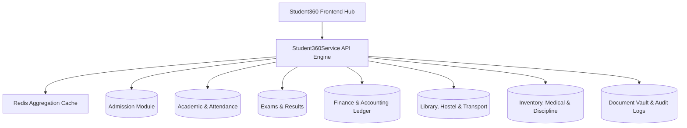

# Volume 09 – Student360 Blueprint (Enterprise SRS)

## 1. Purpose & Core Aggregation Architecture
Student360 হলো পুরো EHRJ Madrasha ERP-এর সবচেয়ে গুরুত্বপূর্ণ এবং কেন্দ্রীয় Unified Profile Hub।
- সিস্টেমে বিদ্যমান কোনো UI Component বা Controller কখনোই আলাদাভাবে বিভিন্ন মডিউল (Admission, Finance, Attendance, Library ইত্যাদি) কোয়েরি করবে না।
- সমস্ত তথ্য **`Student360Service`** ব্যাকএন্ড এগ্রিগেটর সার্ভিস কর্তৃক একক ট্রানজেকশনে সংযুক্ত ও ফিল্টার হয়ে ফ্রন্টএন্ড প্যানেলে সরবরাহিত হবে।
- এতে ১টি মাত্র সিঙ্গেল-ভিউ হাব থেকে একজন শিক্ষার্থীর ভর্তি থেকে শুরু করে গ্র্যাজুয়েশন পর্যন্ত যাবতীয় একাডেমিকাল, আর্থিক, উপস্থিতি, হোস্টেল, লাইব্রেরি, মেডিকেল, ডিসিপ্লিনারি ও সার্টিফিকেট রেকর্ড লাইভ দেখা যাবে।

---

## 2. Student360 Master Sitemap (35+ Sub-routes & Tabs)
```text
/admin/students
├── /admin/students/dashboard
├── /admin/students/create
├── /admin/students/import
├── /admin/students/export
├── /admin/students/settings
└── /admin/students/[id]
    ├── /admin/students/[id]/profile
    ├── /admin/students/[id]/admission
    ├── /admin/students/[id]/guardian
    ├── /admin/students/[id]/academic
    ├── /admin/students/[id]/attendance
    ├── /admin/students/[id]/routine
    ├── /admin/students/[id]/subjects
    ├── /admin/students/[id]/homework
    ├── /admin/students/[id]/assignments
    ├── /admin/students/[id]/exam
    ├── /admin/students/[id]/results
    ├── /admin/students/[id]/finance
    ├── /admin/students/[id]/invoices
    ├── /admin/students/[id]/payments
    ├── /admin/students/[id]/receipts
    ├── /admin/students/[id]/library
    ├── /admin/students/[id]/hostel
    ├── /admin/students/[id]/transport
    ├── /admin/students/[id]/inventory
    ├── /admin/students/[id]/medical
    ├── /admin/students/[id]/discipline
    ├── /admin/students/[id]/achievements
    ├── /admin/students/[id]/documents
    ├── /admin/students/[id]/communication
    ├── /admin/students/[id]/notifications
    ├── /admin/students/[id]/timeline
    ├── /admin/students/[id]/audit
    └── /admin/students/[id]/activity
```

---

## 3. Student360Service Architecture & Module Integration



---

## 4. Key Sub-System Breakdown

1. **Chronological Timeline Engine:** ভর্তি, উপস্থিতি, পরীক্ষার জিপিএ, ফি প্রদান, লাইব্রেরির বই ইস্যু, হোস্টেল সিট পরিবর্তন এবং শাস্তিমূলক নোটিশ—সবকিছু সময়ানুক্রমিক ৩ডি টাইমলাইনে ভিজ্যুয়ালাইজড থাকবে।
2. **Tab-Level RBAC Visibility Matrix:**
   - **Super Admin / Admin:** সম্পূর্ণ ৩৫টি ট্যাবের এক্সেস।
   - **Teacher:** Academic, Attendance, Homework, Exam, Result, Discipline ও Achievement ট্যাব।
   - **Accountant:** Finance, Invoices, Payments, Receipts, Waivers ও Fee summary ট্যাব।
   - **Guardian / Student:** নিজস্ব তথ্য সংশ্লিষ্ট রিড-অনলি ভিউ।
3. **Audit History & Change Tracker:** কে, কখন, কোন ডিভাইসে স্টুডেন্টের কোন তথ্য এডিট করেছে—তার পূর্বের ভ্যালু (Old Value) এবং নতুন ভ্যালুর (New Value) ডিফারেনশিয়াল অডিট ট্রেইল উপস্থাপন।

---

## 5. REST API Integration Contracts (18+ Endpoints)
- `GET /api/v1/student360/dashboard`
- `GET /api/v1/student360/:id`
- `GET /api/v1/student360/:id/profile`
- `GET /api/v1/student360/:id/guardian`
- `GET /api/v1/student360/:id/academic`
- `GET /api/v1/student360/:id/attendance`
- `GET /api/v1/student360/:id/routine`
- `GET /api/v1/student360/:id/results`
- `GET /api/v1/student360/:id/finance`
- `GET /api/v1/student360/:id/library`
- `GET /api/v1/student360/:id/hostel`
- `GET /api/v1/student360/:id/transport`
- `GET /api/v1/student360/:id/inventory`
- `GET /api/v1/student360/:id/medical`
- `GET /api/v1/student360/:id/documents`
- `GET /api/v1/student360/:id/timeline`
- `GET /api/v1/student360/:id/audit`

---

## 6. Master Database Tables Mapped (25 Core Tables)
- `Student`, `Guardian`, `Admission`, `Attendance`, `Routine`, `Homework`, `Assignment`, `Exam`, `ExamResult`, `Invoice`, `InvoiceItem`, `Payment`, `Receipt`, `LibraryMember`, `BookIssue`, `HostelAllocation`, `TransportAllocation`, `InventoryIssue`, `MedicalRecord`, `DisciplineRecord`, `Achievement`, `Document`, `Notification`, `AuditLog`, `ActivityLog`

---

## 7. Performance & Quality Standards
- **Redis Caching:** বারবার ভারী জয়েন কোয়েরি এড়াতে `Student360Service` অটোমেটিক রেডিস ক্যাশ ব্যবহার করবে। কোনো সাব-মডিউল ডাটা আপডেট করলে ইভেন্ট-বাসের মাধ্যমে ক্যাশ ইনভ্যালিডেট হবে।
- **Dynamic PDF & Print:** কিউআর ভেরিফিকেশনসহ স্টুডেন্ট সামারি, ফি রেকর্ড ও মেধার ইতিহাস প্রিন্ট ও পিডিএফ ডাউনলোডের ব্যবস্থা।
- **Zero Mock Policy:** কোনো ফেক টেস্ট ডাটা বা প্লেসহোল্ডার ছাড়াই সম্পূর্ণ রিয়েল-টাইম ডাটা উপস্থাপন।
