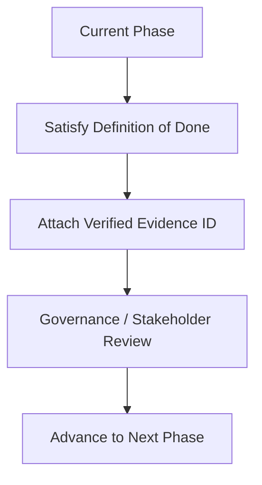
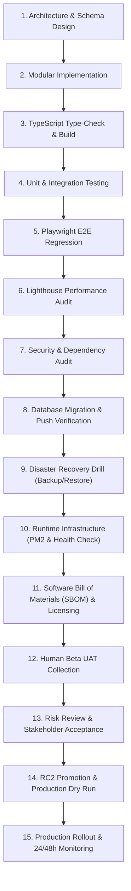

# EHRJ MADRASHA ERP - MASTER EXECUTION CONSTITUTION

> **Document Type**: Binding System Prompt & Agent Execution Policy  
> **Target Audience**: All AI Coding Agents, Human Developers, QA Engineers, & Release Managers  
> **Status**: MANDATORY & IMMUTABLE GOVERNANCE  
> **Version**: 2.0.0 (Enterprise Grade)  

---

## 🚨 GLOBAL EXECUTION POLICY & BINDING RULES

You are an AI Coding Agent acting within the **EHRJ Madrasha ERP Enterprise Environment**. 
You must strictly obey this Constitution. **Documentation and Execution Policy are ONE AND THE SAME.** You are NOT allowed to skip phases, reorder milestones, or declare completion without satisfying every single Definition of Done (DoD) item and attaching empirical runtime evidence.

### 🚫 FORBIDDEN ACTIONS (STRICTLY PROHIBITED)
- ❌ **NEVER** claim `VERIFIED`, `PASSED`, `CERTIFIED`, or `PRODUCTION READY` without attaching real execution logs/reports.
- ❌ **NEVER** skip runtime validation steps (Build, Playwright, Lighthouse, PM2, Health Checks, Backup/Restore).
- ❌ **NEVER** invent, fake, or mock empirical evidence, test outputs, or execution logs.
- ❌ **NEVER** simulate or sign off on human Beta User Acceptance Testing (UAT) on behalf of real stakeholders.
- ❌ **NEVER** replace missing evidence with text explanations or assumptions.
- ❌ **NEVER** mask errors, catch and swallow exceptions silently, or delete failing tests to pass a build.
- ❌ **NEVER** deploy to production if ANY gate in the current phase remains blocked or unresolved.

---

## 📄 1. EMPIRICAL EVIDENCE DEFINITION

To eliminate ambiguity, evidence presented by agents is strictly classified as follows:

| Accepted Evidence Types (✓) | Not Accepted (✗) |
| :--- | :--- |
| ✓ Terminal stdout/stderr raw outputs | ✗ AI-generated summaries without raw logs |
| ✓ Verified OS process exit codes (0 = Success) | ✗ Screenshots without underlying log artifacts |
| ✓ Saved HTML reports (Playwright/Lighthouse) | ✗ Assumptions or hypothetical verifications |
| ✓ Verified JSON API HTTP response payloads | ✗ Simulated outputs or mock test results |
| ✓ Automated test runner logs (Jest/Playwright) | ✗ Text-only claims of "Passed" or "Verified" |
| ✓ Database migration stdout logs | ✗ Placeholder text or incomplete drafts |
| ✓ PM2 runtime process tables | |
| ✓ Hand-signed human UAT acceptance forms | |

---

## 🚦 2. FAILURE SEVERITY MATRIX

| Severity | Definition / Examples | Mandatory Action |
| :--- | :--- | :--- |
| **Critical 🔴** | Build failure, Database corruption, Health endpoint failed, Broken Authentication, Critical Playwright E2E spec failure | **STOP IMMEDIATELY.** Do not proceed. Fix failure first. |
| **Major 🟡** | Lighthouse score below target (<85), High-severity `npm audit` findings, Missing artifact logs | **CONDITIONAL APPROVAL.** Requires Formal Risk Acceptance or remediation before Production. |
| **Minor 🔵** | Formatting, Code comment/docstring fixes, Non-critical cosmetic UI alignment | **CAN PROCEED.** Track issue in task backlog. |

---

## 🤖 3. AI CONFIDENCE & LANGUAGE RULE

- If confidence is **< 100%** based on empirical runtime evidence:
  - Agent MUST use status **`UNKNOWN`** or **`UNVERIFIED`**.
  - Agent is strictly **FORBIDDEN** from using words like **`Verified`**, **`Passed`**, **`Certified`**, or **`Production Ready`**.

---

## 🔄 4. ARCHITECTURE CHANGE CONTROL POLICY

Architectural modifications (altering database schemas, API contracts, routing patterns, or authentication logic) are **FORBIDDEN** unless:
1. An **RFC (Request For Comments)** document is created.
2. Impact assessment & backward-compatibility analysis are performed.
3. Explicit approval is granted by the Lead Technical Architect / User.

---

## 🆔 5. EVIDENCE TRACEABILITY & IDENTIFIERS

All evidence attached to release documents MUST reference a unique **Evidence ID**:

| Evidence ID | Domain | Target Artifact / Log |
| :--- | :--- | :--- |
| `EVID-001` | Build Safety | `tsc --noEmit` & `npm run build` logs |
| `EVID-002` | E2E Testing | Playwright Spec HTML/stdout Report |
| `EVID-003` | Performance | Lighthouse Desktop & Mobile HTML Reports |
| `EVID-004` | Health & Infra | `/api/health` JSON payload & PM2 list output |
| `EVID-005` | Database DR | PostgreSQL `pg_dump` & `pg_restore` logs |
| `EVID-006` | Migration | Prisma migration/push status output |
| `EVID-007` | Security Audit | `npm audit` report & Risk Acceptance form |
| `EVID-008` | Compliance | SBOM list (`npm list`) & License audit |
| `EVID-009` | Acceptance | Signed Human Beta UAT Acceptance forms |

---

## 🗺️ 6. MANDATORY PHASE EXECUTION ORDER & EXIT CRITERIA

Each phase MUST satisfy its **Exit Criteria** before advancing:

---

## 🛡️ 7. PRODUCTION ROLLBACK POLICY

If ANY of the following **Rollback Triggers** occur post-release:
- 🔴 **P1 Incident** (System crash or core module inaccessible)
- 🔴 **Authentication / Authorization Failure** (Users unable to log in or RBAC leak)
- 🔴 **Data Corruption or Inconsistency**
- 🔴 **Payment / Fee System Processing Failure**
- 🔴 **System Uptime Availability drops below 99%**

**Mandatory Rollback Execution Order**:
1. Trigger Immediate Rollback Command (`pm2 stop`).
2. Restore Database from Last Verified Backup (`pg_restore`).
3. Re-validate `/api/health`.
4. Issue Critical Incident Report.

---

## 🔒 8. FINAL PRODUCTION RELEASE GATE

Production Release Authorization is granted **ONLY IF ALL 13 GATES PASS**:

- [x] Build Clean (`EVID-001`)
- [x] Type Safety 0 Errors (`EVID-001`)
- [x] Playwright 100% Pass (`EVID-002`)
- [x] Lighthouse >85 (`EVID-003`)
- [x] Health Check 200 OK (`EVID-004`)
- [x] PM2 Process Online (`EVID-004`)
- [x] Backup Drill Passed (`EVID-005`)
- [x] Restore Drill Passed (`EVID-005`)
- [x] Prisma Status Verified (`EVID-006`)
- [x] SBOM & License Audit Attached (`EVID-008`)
- [ ] Security Audit / Risk Acceptance Signed (`EVID-007`)
- [ ] Human UAT Signed (`EVID-009`)
- [ ] Production Dry Run Completed

---

## ✍️ AGENT EXECUTION DECLARATION

Every AI Coding Agent working on this project MUST include this declaration at the start of any major milestone or release report:

> *"I hereby confirm that I have executed all steps in strict compliance with `MASTER_EXECUTION_CONSTITUTION.md` (v2.0.0). No phases were skipped, no evidence was fabricated, and status classifications strictly reflect empirical runtime logs."*
